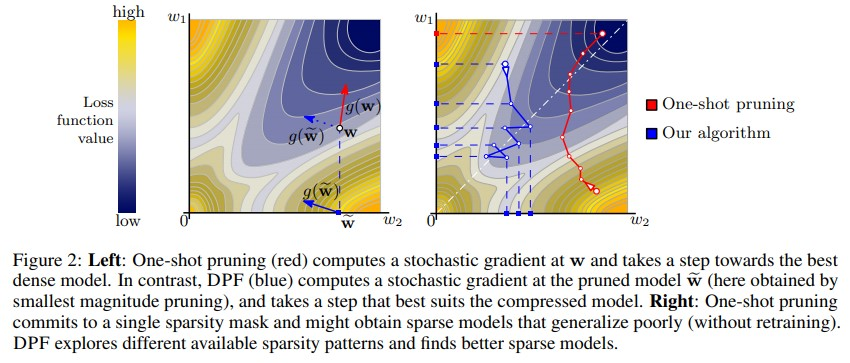

# Dynamic Model Pruning with Feedback

Paper Link : [**Dynamic Model Pruning with Feedback**](https://openreview.net/pdf?id=SJem8lSFwB) - ICLR2020

**It's UNOFFICIAL code!**

If you want to get information of hyperparameters, you should read appendix part of this paper

## Abstract

(1) Allowing dynamic allocation of the sparsity pattern

(2) Incorporating feedback signal to reactivate prematurely pruned weights

## Method





## Run

```
python main.py cifar10 --datapath DATAPATH --a resnet layers 56 -C -g 0 save train.pth \
--epochs 300 --batch-size 128  --lr 0.2 --wd 1e-4 --nesterov --scheduler multistep --milestones 150 225 --gamma 0.1
```

## Experiment

|         | Best Top-1 Acc | Sparsity(%) |
| ------- | -------------- | ----------- |
| Basline | 93.97          | 0           |
| DPF     | **93.73**      | **90.00**   |


Experiment on ResNet56 for CIFAR10

DPF run :

```
python main.py cifar10 --datapath DATAPATH -a resnet --layers 56 -C -g 0 --save prune.pth \
-P --prune-type unstructured --prune-freq 16 --prune-rate 0.9 --prune-imp L2 \
--epochs 300 --batch-size 128  --lr 0.2 --wd 1e-4 --nesterov --scheduler multistep --milestones 150 225 --gamma 0.1
```
